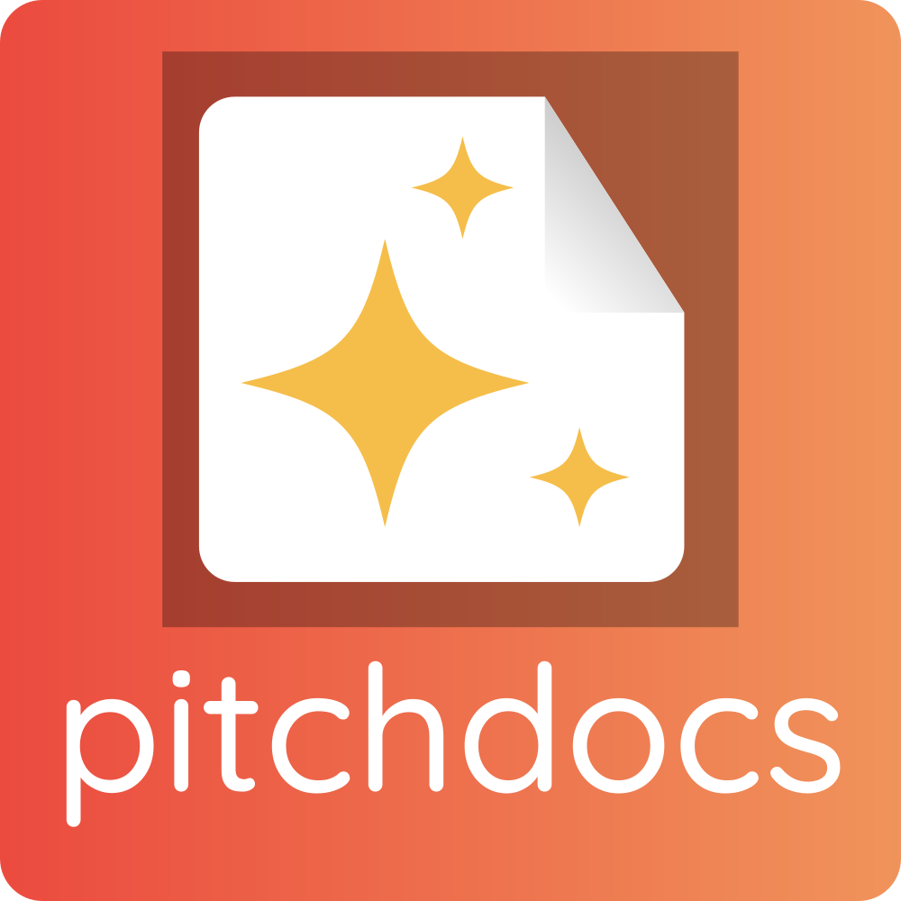

<p align="center">
  
</p>

<p align="center">
  <strong>Turn any codebase into professional, marketing-ready GitHub documentation — powered by AI coding assistants.</strong>
</p>

<p align="center">
  Give your AI the knowledge to map out any codebase, extract a features-and-benefits summary, then create, enhance, and maintain professional public-facing GitHub repository docs — SEO and GEO ready with llms.txt (including external documentation sites), and npm/PyPI registry compatible.
</p>

<p align="center">
  <a href="CHANGELOG.md"></a> <!-- x-release-please-version -->
  <a href="LICENSE"></a>
  <a href="https://code.claude.com/docs/en/plugins"></a>
  <a href="https://opencode.ai/"></a>
  <a href="https://www.npmjs.com/"></a>
</p>

<p align="center">
  <a href="#-get-started">Get Started</a> · <a href="#-features">Features</a> · <a href="#%EF%B8%8F-how-pitchdocs-compares">How It Compares</a> · <a href="#-commands">Commands</a> · <a href="#-use-with-other-ai-tools">Other AI Tools</a> · <a href="CONTRIBUTING.md">Contributing</a>
</p>

---

## ⚡ Get Started

Get your first generated README in under 60 seconds.

### Prerequisites

- [Claude Code](https://code.claude.com/) or [OpenCode](https://opencode.ai/) installed

### Claude Code / OpenCode

```bash
# 1. Add the LBA plugin marketplace (once)
/plugin marketplace add littlebearapps/lba-plugins

# 2. Install PitchDocs
/plugin install pitchdocs@lba-plugins

# 3. Generate a README for any project
/readme
```

**Optional — install quality rules and hooks (Claude Code only):**

```bash
# 4. Install Context Guard hooks for AI context file freshness
/context-guard install
```

Keeps your AI context files (AGENTS.md, CLAUDE.md, etc.) in sync as your project evolves. Uninstall anytime with `/context-guard uninstall`.

OpenCode reads `.claude/skills/` natively — the same install steps (1–3) work in both tools.

**Using Codex CLI, Cursor, Windsurf, Cline, Gemini CLI, Aider, or Goose?** See [Use with Other AI Tools](#-use-with-other-ai-tools) for setup instructions.

---

## 🚀 What PitchDocs Does

Your repo is ready to go public, but the docs aren't. You need a README that sells, a CHANGELOG that makes sense to users, a SECURITY policy, contributing guidelines, issue templates, PR templates — and it all needs to look professional.

PitchDocs gives your AI coding assistant the skills and knowledge to scan your codebase, find what's worth talking about, and write the whole documentation suite for you. README, CHANGELOG, CONTRIBUTING, ROADMAP, CODE_OF_CONDUCT, SECURITY, issue templates, PR templates, user guides, AI context files, and `llms.txt` — all from slash commands like `/readme` and `/docs-audit fix`.

Every generated doc is GEO and SEO optimised, npm and PyPI registry compatible, and backed by evidence from your actual code.

---

## 🎯 Features

- 🔍 **Evidence-based feature extraction** — scans 10 signal categories in your code and backs every claim with a file path
- 📋 **Full docs suite from one command** — README, CHANGELOG, CONTRIBUTING, ROADMAP, SECURITY, issue templates, and 15+ more files
- ✅ **4-question test on every doc** — does this solve my problem? can I use it? who made it? where do I learn more?
- 🎯 **Benefit-driven language** — turns technical features into user outcomes with 5 benefit categories and evidence requirements
- 🤖 **AI context file generation** — AGENTS.md, CLAUDE.md, .cursorrules, copilot-instructions.md, and 3 more from one codebase scan
- 🔎 **GEO-optimised for AI citation** — structured so ChatGPT, Perplexity, and Google AI Overviews cite your project accurately
- 📊 **Quality scoring (0–100)** — grades docs on completeness, structure, freshness, and link health — export to CI with `--min-score`
- 🔗 **Documentation verification** — broken links, stale content, heading hierarchy, badge URLs, and credential scanning
- 📡 **llms.txt generation** — AI-readable content indices following the [llmstxt.org](https://llmstxt.org/) spec
- 🚀 **Launch artifacts** — Dev.to articles, Hacker News posts, Reddit posts, Twitter/X threads, and awesome list submissions
- 🔒 **Context Guard** — post-commit hooks detect stale AI context files before they mislead your assistant *(Claude Code only)*
- 📦 **npm and PyPI ready** — audit registry metadata and ensure README renders correctly across GitHub, npm, and PyPI
- 🗂️ **Diataxis framework** — classify docs into tutorials, how-to guides, reference, and explanation quadrants
- 🔄 **Upstream spec tracking** — a GitHub Action checks monthly that your CHANGELOG, CODE_OF_CONDUCT, and commit conventions follow the latest spec versions
- ♻️ **Install once, use everywhere** — add the plugin once and use it across all your projects without repeating setup
- 🔌 **Works with 9 AI tools** — Claude Code, OpenCode, Codex CLI, Cursor, Windsurf, Cline, Gemini CLI, Aider, Goose

---

## ⚖️ How PitchDocs Compares

| Capability | PitchDocs | Manual Writing | [readme.so](https://readme.so/) | [readmeai](https://github.com/eli64s/readme-ai) | Generic AI Prompt |
|-----------|-----------|----------------|--------------------------------|--------------------------------------------------|-------------------|
| Scans codebase for features | 10 signal categories with file-level evidence | You decide what to include | No | Basic directory scan | Depends on prompt quality |
| Benefit-driven language | Built-in framework (5 categories, evidence required) | If you know how | No | AI-generated, unstructured | Hit or miss |
| Full docs suite (20+ files) | One command: `/docs-audit fix` | Hours of manual work | README only | README only | One file at a time |
| GEO / AI citation optimised | Atomic sections, comparison tables, concrete stats, llms.txt | If you know GEO | No | No | No |
| AI context files | AGENTS.md, CLAUDE.md, .cursorrules, copilot-instructions.md, .windsurfrules, .clinerules, GEMINI.md | Manual | No | No | No |
| Launch artifacts | Dev.to, HN, Reddit, Twitter, awesome lists | Manual per platform | No | No | No |
| Documentation verification | Links, freshness, llms.txt sync, heading hierarchy, badges | Manual review | No | No | No |
| Cross-tool compatibility | 9 AI coding tools with documented setup | N/A | N/A | CLI only | Tool-specific |
| Upstream spec tracking | Monthly GitHub Action drift checks | Manual | No | No | No |
| Reusable across projects | Install once, use everywhere | Start from scratch | Start from scratch | Run per project | Re-prompt each time |

---

## 🤖 Commands

| Command | What It Does | Why It Matters |
|---------|-------------|----------------|
| `/readme` | Generate or update a marketing-friendly README.md | First impressions that convert browsers to users |
| `/features` | Extract features from code and translate to benefits — output as inventory, table, or emoji+bold+em-dash bullets | Never miss a feature worth documenting |
| `/changelog` | Generate CHANGELOG.md from git history with user-benefit language | Users see what changed for *them*, not your commit log |
| `/roadmap` | Generate ROADMAP.md from GitHub milestones and issues | Show contributors where the project is heading |
| `/docs-audit` | Audit docs completeness, quality, GitHub metadata, visual assets, AI context files, Diataxis coverage, and npm/PyPI registry config | Catch gaps in files, metadata, images, and package registry fields before you ship |
| `/llms-txt` | Generate llms.txt and llms-full.txt for AI discoverability | AI coding assistants and search engines find and understand your docs |
| `/user-guide` | Generate task-oriented user guides in `docs/guides/` with Diataxis classification | Readers find answers without reading your source code |
| `/ai-context` | Generate AGENTS.md, CLAUDE.md, .cursorrules, copilot-instructions.md, .windsurfrules, .clinerules, GEMINI.md from codebase analysis | AI coding assistants understand your project's conventions from day one |
| `/docs-verify` | Verify links, freshness, llms.txt sync, heading hierarchy, and badge URLs | Catch documentation decay before it reaches users |
| `/launch` | Generate Dev.to articles, HN posts, Reddit posts, Twitter threads, awesome list submissions | Transform docs into platform-specific launch content |
| `/doc-refresh` | Refresh all docs after version bumps — CHANGELOG, README features, user guides, AI context, llms.txt | Never ship a release with stale documentation |
| `/context-guard` | Install, uninstall, or check status of Context Guard hooks for AI context file freshness | Catch stale context files automatically after commits and structural changes |

**Note:** `/context-guard` is **Claude Code only**. All other commands work across all supported AI tools.

### Quick Examples

```bash
/readme                   # Generate a marketing-friendly README
/features bullets         # Extract features as emoji+bold+em-dash bullets
/docs-audit fix           # Audit and auto-generate missing docs
/changelog full           # Generate full changelog from all tags
/ai-context               # Generate AI context files for all tools
/docs-verify              # Check for broken links and stale content
/doc-refresh              # Refresh all docs for an upcoming release
```

---

## 🔀 Use with Other AI Tools

PitchDocs works natively with [Claude Code](https://code.claude.com/) and [OpenCode](https://opencode.ai/). It's also portable to [Codex CLI](https://codex.openai.com/), [Cursor](https://cursor.com/), [Windsurf](https://codeium.com/windsurf), [Cline](https://github.com/cline/cline), [Gemini CLI](https://github.com/google-gemini/gemini-cli), [Aider](https://aider.chat/), and [Goose](https://github.com/block/goose) — all knowledge is stored as plain Markdown files.

See the [Other AI Tools guide](docs/guides/other-ai-tools.md) for per-tool setup instructions and a full compatibility matrix.

---

## 📚 Documentation

- [Getting Started Guide](docs/guides/getting-started.md) — Installation, first README generation, and full command walkthrough
- [Other AI Tools](docs/guides/other-ai-tools.md) — Setup for Codex CLI, Cursor, Windsurf, Cline, Gemini CLI, Aider, and Goose
- [Documentation Hub](docs/README.md) — All guides, command reference, and skills reference

---

## 🤝 Contributing

Found a way to make generated docs even better? We'd love your help — whether it's improving a template, fixing a language rule, or suggesting a new doc type entirely.

See our [Contributing Guide](CONTRIBUTING.md) to get started, or jump straight in:

- [Good First Issues](https://github.com/littlebearapps/pitchdocs/labels/good%20first%20issue) — Great starting points
- [Feature Requests](https://github.com/littlebearapps/pitchdocs/issues/new?template=feature_request.yml) — Suggest improvements
- [Open Issues](https://github.com/littlebearapps/pitchdocs/issues) — See what needs doing

---

## 📄 Licence

[MIT](LICENSE) — Made by [Little Bear Apps](https://littlebearapps.com) 🐶
