<p align="center">
  
</p>

<p align="center">
  <strong>Turn any codebase into professional, marketing-ready GitHub documentation — powered by AI coding assistants.</strong>
</p>

<p align="center">
  Give your AI the knowledge to map out any codebase, extract a features-and-benefits summary, then create, enhance, and maintain professional public-facing GitHub repository docs — SEO and GEO ready with llms.txt (including external documentation sites), and npm/PyPI registry compatible.
</p>

<p align="center">
  <a href="CHANGELOG.md"></a> <!-- x-release-please-version -->
  <a href="LICENSE"></a>
  <a href="https://code.claude.com/docs/en/plugins"></a>
  <a href="https://opencode.ai/"></a>
  <a href="https://www.npmjs.com/"></a>
</p>

<p align="center">
  <a href="#-get-started">Get Started</a> · <a href="#-features">Features</a> · <a href="#%EF%B8%8F-how-pitchdocs-compares">How It Compares</a> · <a href="#-commands">Commands</a> · <a href="#-skills">Skills</a> · <a href="#-use-with-other-ai-tools">Other AI Tools</a> · <a href="CONTRIBUTING.md">Contributing</a> · <a href="commands/doc-refresh.md">Doc Refresh</a>
</p>

---

## ⚡ Get Started

Get your first generated README in under 60 seconds.

### Prerequisites

- [Claude Code](https://code.claude.com/) or [OpenCode](https://opencode.ai/) installed

### Claude Code / OpenCode

```bash
# 1. Add the LBA plugin marketplace (once)
/plugin marketplace add littlebearapps/lba-plugins

# 2. Install PitchDocs
/plugin install pitchdocs@lba-plugins

# 3. Generate a README for any project
/readme
```

**Optional — install quality rules and hooks (Claude Code only):**

```bash
# 4. Install Context Guard hooks for AI context file freshness
/context-guard install
```

Keeps your AI context files (AGENTS.md, CLAUDE.md, etc.) in sync as your project evolves. See [Context Guard](#-skills) for details, or uninstall with `/context-guard uninstall`.

OpenCode reads `.claude/skills/` natively — the same install steps (1–3) work in both tools.

**Using Codex CLI, Cursor, Windsurf, Cline, Gemini CLI, Aider, or Goose?** See [Use with Other AI Tools](#-use-with-other-ai-tools) for setup instructions.

---

## 🚀 What PitchDocs Does

Run `/readme` and get a marketing-friendly README in under 60 seconds — hero section, benefit-driven features, working quick start, and proper badges, all backed by evidence from your actual code.

Need the full suite? `/docs-audit fix` scans your repo against a 20+ file checklist and generates everything that's missing: CHANGELOG, CONTRIBUTING, ROADMAP, CODE_OF_CONDUCT, SECURITY, issue templates, PR templates, and more. Or use individual commands (`/changelog`, `/roadmap`, `/user-guide`) for just what you need.

PitchDocs also handles discoverability — `llms.txt` for AI search engines, AI context files (AGENTS.md, CLAUDE.md, .cursorrules, and 4 more) for coding assistants, GEO-optimised structure for AI citation, npm/PyPI metadata auditing, and launch artifacts for Dev.to, Hacker News, and Reddit.

### How it works

```mermaid
flowchart LR
    A["🔍 Scan<br/>your code"] --> B["📋 Find<br/>features"]
    B --> C["✍️ Write<br/>the docs"]
    C --> D["✅ Check<br/>quality"]

    style A fill:#1e3a5f,stroke:#4a9eff,color:#fff
    style B fill:#1e3a5f,stroke:#4a9eff,color:#fff
    style C fill:#1e3a5f,stroke:#4a9eff,color:#fff
    style D fill:#1e3a5f,stroke:#4a9eff,color:#fff
```



---

## 🎯 Features

- 🔍 **Evidence-based feature extraction** — scans 10 signal categories in your code and backs every claim with a file path
- 📋 **Full docs suite from one command** — README, CHANGELOG, CONTRIBUTING, ROADMAP, SECURITY, issue templates, and 15+ more files
- ✅ **4-question test on every doc** — does this solve my problem? can I use it? who made it? where do I learn more?
- 🎯 **Benefit-driven language** — turns technical features into user outcomes with 5 benefit categories and evidence requirements
- 🤖 **AI context file generation** — AGENTS.md, CLAUDE.md, .cursorrules, copilot-instructions.md, and 3 more from one codebase scan
- 🔎 **GEO-optimised for AI citation** — structured so ChatGPT, Perplexity, and Google AI Overviews cite your project accurately
- 📊 **Quality scoring (0–100)** — grades docs on completeness, structure, freshness, and link health — export to CI with `--min-score`
- 🔗 **Documentation verification** — broken links, stale content, heading hierarchy, badge URLs, and credential scanning
- 📡 **llms.txt generation** — AI-readable content indices following the [llmstxt.org](https://llmstxt.org/) spec
- 🚀 **Launch artifacts** — Dev.to articles, Hacker News posts, Reddit posts, Twitter/X threads, and awesome list submissions
- 🔒 **Context Guard** — post-commit hooks detect stale AI context files before they mislead your assistant *(Claude Code only)*
- 📦 **npm and PyPI ready** — audit registry metadata and ensure README renders correctly across GitHub, npm, and PyPI
- 🗂️ **Diataxis framework** — classify docs into tutorials, how-to guides, reference, and explanation quadrants
- 🔌 **Works with 9 AI tools** — Claude Code, OpenCode, Codex CLI, Cursor, Windsurf, Cline, Gemini CLI, Aider, Goose

### By the Numbers

| Metric | Count | Evidence |
|--------|-------|----------|
| Slash commands | 12 | `commands/*.md` — README, features, changelog, roadmap, docs audit, llms.txt, user guide, AI context, docs verify, launch, doc refresh, context guard |
| Reference skills | 14 | `.claude/skills/*/SKILL.md` — loaded on-demand for deep knowledge in each doc type |
| Quality rules | 2 | `.claude/rules/*.md` — doc-standards (cross-tool) and context-quality (Claude Code only) |
| Signal categories scanned | 10 | Feature extraction covers CLI, API, config, integrations, data models, and 5 more ([detail](commands/features.md)) |
| Docs audit checklist | 20+ files | README through CITATION.cff across 3 priority tiers ([detail](commands/docs-audit.md)) |
| AI tools supported | 9 | Claude Code, OpenCode, Codex CLI, Cursor, Windsurf, Cline, Gemini CLI, Aider, Goose |
| Benefit categories | 5 | Time saved, confidence gained, pain avoided, capability unlocked, cost reduced |
| Job types mapped | 3 | Functional, emotional, social (JTBD framework for richer benefit writing) |
| Upstream specs tracked | 8 | Frozen and evolving specs checked monthly by GitHub Action |
| Launch platforms | 5 | Dev.to, Hacker News, Reddit, Twitter/X, awesome lists |

---

## ⚖️ How PitchDocs Compares

| Capability | PitchDocs | Manual Writing | [readme.so](https://readme.so/) | [readmeai](https://github.com/eli64s/readme-ai) | Generic AI Prompt |
|-----------|-----------|----------------|--------------------------------|--------------------------------------------------|-------------------|
| Scans codebase for features | 10 signal categories with file-level evidence | You decide what to include | No | Basic directory scan | Depends on prompt quality |
| Benefit-driven language | Built-in framework (5 categories, evidence required) | If you know how | No | AI-generated, unstructured | Hit or miss |
| Full docs suite (20+ files) | One command: `/docs-audit fix` | Hours of manual work | README only | README only | One file at a time |
| GEO / AI citation optimised | Atomic sections, comparison tables, concrete stats, llms.txt | If you know GEO | No | No | No |
| AI context files | AGENTS.md, CLAUDE.md, .cursorrules, copilot-instructions.md, .windsurfrules, .clinerules, GEMINI.md | Manual | No | No | No |
| Launch artifacts | Dev.to, HN, Reddit, Twitter, awesome lists | Manual per platform | No | No | No |
| Documentation verification | Links, freshness, llms.txt sync, heading hierarchy, badges | Manual review | No | No | No |
| Cross-tool compatibility | 9 AI coding tools with documented setup | N/A | N/A | CLI only | Tool-specific |
| Upstream spec tracking | Monthly GitHub Action drift checks | Manual | No | No | No |
| Reusable across projects | Install once, use everywhere | Start from scratch | Start from scratch | Run per project | Re-prompt each time |

---

## 🤖 Commands

| Command | What It Does | Why It Matters |
|---------|-------------|----------------|
| `/readme` | Generate or update a marketing-friendly README.md | First impressions that convert browsers to users |
| `/features` | Extract features from code and translate to benefits — output as inventory, table, or bold+em-dash bullets | Never miss a feature worth documenting |
| `/changelog` | Generate CHANGELOG.md from git history with user-benefit language | Users see what changed for *them*, not your commit log |
| `/roadmap` | Generate ROADMAP.md from GitHub milestones and issues | Show contributors where the project is heading |
| `/docs-audit` | Audit docs completeness, quality, GitHub metadata, visual assets, AI context files, Diataxis coverage, and npm/PyPI registry config | Catch gaps in files, metadata, images, and package registry fields before you ship |
| `/llms-txt` | Generate llms.txt and llms-full.txt for AI discoverability | AI coding assistants and search engines find and understand your docs |
| `/user-guide` | Generate task-oriented user guides in `docs/guides/` with Diataxis classification | Readers find answers without reading your source code |
| `/ai-context` | Generate AGENTS.md, CLAUDE.md, .cursorrules, copilot-instructions.md, .windsurfrules, .clinerules, GEMINI.md from codebase analysis | AI coding assistants understand your project's conventions from day one |
| `/docs-verify` | Verify links, freshness, llms.txt sync, heading hierarchy, and badge URLs | Catch documentation decay before it reaches users |
| `/launch` | Generate Dev.to articles, HN posts, Reddit posts, Twitter threads, awesome list submissions | Transform docs into platform-specific launch content |
| `/doc-refresh` | Refresh all docs after version bumps — CHANGELOG, README features, user guides, AI context, llms.txt | Never ship a release with stale documentation |
| `/context-guard` | Install, uninstall, or check status of Context Guard hooks for AI context file freshness | Catch stale context files automatically after commits and structural changes |

The **docs-writer** agent powers the documentation commands — it scans your codebase, extracts features with evidence, and writes docs that pass the 4-question test.

**Note:** `/context-guard` is **Claude Code only** — it installs PostToolUse hooks that are specific to Claude Code's hook system. OpenCode, Codex CLI, and other tools do not support these hooks. All other commands work across all supported AI tools.

### Quick Examples

```bash
# Generate a README for the current project
/readme

# Extract features from code and output a benefits table
/features table

# Extract features as bold+em-dash bullets for a README
/features bullets

# Audit features: what's documented vs what's in the code
/features audit

# Generate the full changelog from all tags
/changelog full

# Audit what docs are missing and auto-generate them
/docs-audit fix

# Generate llms.txt for AI tool discoverability
/llms-txt

# Generate both llms.txt and llms-full.txt
/llms-txt full

# Generate a getting-started user guide
/user-guide getting-started

# Generate AI context files for all supported tools
/ai-context

# Generate CLAUDE.md only
/ai-context claude

# Verify all docs for broken links and stale content
/docs-verify

# Generate launch artifacts for all platforms
/launch

# Generate a Dev.to article from your README
/launch devto

# Refresh all docs for the upcoming release
/doc-refresh

# Dry run — see what needs refreshing before writing anything
/doc-refresh plan

# Refresh docs for a specific version
/doc-refresh 1.7.0

# Install Context Guard hooks (Claude Code only)
/context-guard install

# Check if context files are stale
/context-guard status
```

---

## 📚 Skills

Skills are loaded on-demand to provide deep reference knowledge:

| Skill | What You Get |
|-------|-------------|
| `public-readme` | README structure with three-part hero, audience-segmented value proposition, use-case framing, bold+em-dash features, Time to Hello World targets, GEO patterns, and the Daytona/Banesullivan marketing framework |
| `feature-benefits` | 5-step codebase scanning workflow across 10 signal categories with JTBD job mapping and evidence-based benefit translation — outputs as inventory, table, or bold+em-dash bullets |
| `changelog` | Keep a Changelog format with language rules that rewrite commits into user-facing benefit language |
| `roadmap` | Roadmap structure from GitHub milestones with emoji status indicators and community involvement section |
| `pitchdocs-suite` | 20+ file inventory, GitHub metadata, AI context files, visual assets guidance, licence selection framework, and ready-to-use templates |
| `llms-txt` | llmstxt.org specification reference with generation patterns for repos and docs sites |
| `package-registry` | npm and PyPI metadata field inventories, README cross-renderer compatibility, trusted publishing guidance, and registry badges |
| `user-guides` | Task-oriented how-to documentation with Diataxis framework, numbered steps, copy-paste-ready code, error recovery, and cross-linked hub pages |
| `ai-context` | AI IDE context file generation — AGENTS.md, CLAUDE.md, .cursorrules, copilot-instructions.md, .windsurfrules, .clinerules, GEMINI.md from codebase analysis with staleness audit |
| `docs-verify` | Documentation validation — broken links, stale content, llms.txt sync, heading hierarchy, badge URLs, and CI-friendly output |
| `launch-artifacts` | Platform-specific launch content — Dev.to articles, HN posts, Reddit posts, Twitter threads, awesome list submissions |
| `api-reference` | API reference generator guidance — TypeDoc, Sphinx, godoc, rustdoc configuration templates and comment conventions |
| `doc-refresh` | Version-bump documentation orchestration — change detection from git history, selective doc refresh, release-please integration, and quality score tracking |
| `context-guard` | Context Guard installation reference — hook architecture, settings.json configuration, customisation, and troubleshooting *(Claude Code only)* |

---

## 🔀 Use with Other AI Tools

PitchDocs is built as a Claude Code plugin, but the documentation knowledge it contains — skills, agent workflows, quality standards — is stored as plain Markdown files with YAML frontmatter. That makes it portable to other AI coding tools with minimal effort.

The source of truth lives in `.claude/`. Here's what's inside and what each piece does:

| Directory | Contents | Purpose | Cross-Tool? |
|-----------|----------|---------|-------------|
| `.claude/skills/*/SKILL.md` | 14 skill files | Reference knowledge for all doc types plus context guard installation | Yes — Claude Code, OpenCode, Codex CLI |
| `.claude/agents/docs-writer.md` | 1 agent file | Orchestration workflow: codebase scanning → feature extraction → doc writing → validation | Partial — Claude Code, OpenCode (may vary) |
| `.claude/rules/doc-standards.md` | 1 rule file | Quality standards: 4-question framework, GEO optimisation, progressive disclosure, benefit-driven language | **Claude Code only** |
| `.claude/rules/context-quality.md` | 1 rule file | AI context file quality standards: cross-file consistency, path verification, sync points | **Claude Code only** |
| `commands/*.md` | 12 command files | Slash command definitions for all PitchDocs commands | Yes — Claude Code, OpenCode |
| `hooks/*.sh` | 2 hook scripts | Post-commit drift detection and structural change reminders for AI context files | **Claude Code only** |

### Tool Compatibility Summary

Not all PitchDocs features work in every tool. Here's what's portable and what's Claude Code-specific:

| Feature | Claude Code | OpenCode | Codex CLI | Cursor / Windsurf / Cline / Gemini CLI |
|---------|------------|----------|-----------|----------------------------------------|
| Skills (14 SKILL.md files) | Native | Native (`.claude/skills/` fallback) | Copy to `.agents/skills/` | Reference on demand |
| Slash commands (12) | Native | Native (`.claude/commands/` fallback) | Copy to prompts | Not supported |
| Docs-writer agent | Native | Likely supported | Reference manually | Cursor: `.cursor/agents/` |
| Doc-standards rule | Auto-loaded | Not supported | Not supported | Cursor: `.cursor/rules/` |
| Context-quality rule | Auto-loaded | Not supported | Not supported | Not supported |
| Context Guard hooks | Native (opt-in) | Not supported | Not supported | Not supported |
| AGENTS.md | Loaded | Primary context file | Primary context file | Not used |
| CLAUDE.md | Loaded | Fallback (if no AGENTS.md) | Not used | Not used |

### OpenCode

[OpenCode](https://opencode.ai/) reads `.claude/skills/` natively — PitchDocs works out of the box with no extra setup.

**Install** the same way as Claude Code (clone or add as a plugin), then invoke skills by name in your OpenCode session. The 13 SKILL.md files, the docs-writer agent, and the doc-standards rule are all picked up automatically.

OpenCode also supports MCP servers, so if you have the GitHub MCP server configured, the docs-writer agent can access repository metadata, issues, and releases just as it does in Claude Code.

### Codex CLI

[Codex CLI](https://codex.openai.com/) (OpenAI) uses the same SKILL.md format as Claude Code but looks for skills at a different path: `.agents/skills/` instead of `.claude/skills/`.

**Step 1 — Copy skills into your project:**

```bash
# From your project root (not the PitchDocs repo)
PITCHDOCS="/path/to/pitchdocs"

# Copy all 13 skills
cp -r "$PITCHDOCS/.claude/skills/"* .agents/skills/

# Copy the quality standards as AGENTS.md (Codex reads this automatically)
cp "$PITCHDOCS/AGENTS.md" ./AGENTS.md
```

**Step 2 — Use the skills:**

Codex CLI loads SKILL.md files automatically when they're in `.agents/skills/`. Ask it to generate documentation and it will have access to the PitchDocs frameworks:

```
> Generate a marketing-friendly README for this project using the public-readme skill
> Extract features and benefits from this codebase using the feature-benefits skill
```

**Step 3 (optional) — Add slash commands:**

Copy PitchDocs command files into your Codex prompts directory to get `/prompts:readme`, `/prompts:changelog`, etc.:

```bash
cp "$PITCHDOCS/commands/"*.md ~/.codex/prompts/pitchdocs/
```

### Cursor

[Cursor](https://cursor.com/) uses `.cursor/rules/*.mdc` files for contextual rules and `.cursor/agents/*.md` for subagents. It doesn't read SKILL.md files, but you can adapt PitchDocs content to Cursor's format.

**Step 1 — Add the documentation standards as a Cursor rule:**

Create `.cursor/rules/doc-standards.mdc` in your project:

```
---
description: PitchDocs documentation quality standards — 4-question framework, benefit-driven language, progressive disclosure, marketing-friendly structure
---

(Paste the contents of .claude/rules/doc-standards.md here, without its YAML frontmatter)
```

Because this rule has a `description` but no `globs` or `alwaysApply`, Cursor treats it as an **agent-selected rule** — it gets included automatically when the AI determines it's relevant to your request.

**Step 2 — Add the docs-writer agent:**

Create `.cursor/agents/docs-writer.md` in your project:

```
---
name: docs-writer
description: Generates high-quality public-facing repository documentation with marketing appeal
---

(Paste the contents of .claude/agents/docs-writer.md here, without its YAML frontmatter)
```

**Step 3 — Reference skills on demand:**

Cursor doesn't have a skills directory, but you can reference PitchDocs skill files directly. Clone the PitchDocs repo somewhere accessible, then ask Cursor:

```
> Read the file at /path/to/pitchdocs/.claude/skills/public-readme/SKILL.md and use it to generate a README for this project
```

Or paste specific skill content into additional `.cursor/rules/*.mdc` files for the skills you use most often.

### Windsurf

[Windsurf](https://codeium.com/windsurf) (by Codeium) uses `.windsurfrules` for project-level context. Its Cascade AI reads this file from the project root automatically.

**Step 1 — Add the documentation standards:**

Create `.windsurfrules` in your project root:

```bash
# Copy the doc-standards rule as Windsurf context
cp /path/to/pitchdocs/.claude/rules/doc-standards.md .windsurfrules
```

Or use `/ai-context windsurf` in Claude Code to generate a tailored `.windsurfrules` from your codebase analysis.

**Step 2 — Reference skills on demand:**

Windsurf can read files from your workspace. Ask Cascade to load specific skill files:

```
> Read /path/to/pitchdocs/.claude/skills/public-readme/SKILL.md and use it to generate a README for this project
```

### Cline

[Cline](https://github.com/cline/cline) (VS Code extension) uses `.clinerules` for project-level context. It supports richer Markdown with task checklists.

**Step 1 — Add the documentation standards:**

Create `.clinerules` in your project root:

```bash
# Copy the doc-standards rule as Cline context
cp /path/to/pitchdocs/.claude/rules/doc-standards.md .clinerules
```

Or use `/ai-context cline` in Claude Code to generate a tailored `.clinerules` from your codebase analysis.

**Step 2 — Reference skills on demand:**

Cline can read files from your workspace. Reference PitchDocs skill files directly in your Cline session:

```
Read /path/to/pitchdocs/.claude/skills/public-readme/SKILL.md and use it to generate a README for this project
```

### Gemini CLI

[Gemini CLI](https://github.com/google-gemini/gemini-cli) uses `GEMINI.md` for project context and `.gemini/commands/*.toml` for custom commands. It doesn't read SKILL.md files directly, but the knowledge transfers easily.

**Option A — Quick setup (context file):**

Copy the documentation standards into your project's Gemini context:

```bash
# Create .gemini/ directory
mkdir -p .gemini

# Use the doc-standards rule as your base context
cp /path/to/pitchdocs/.claude/rules/doc-standards.md .gemini/GEMINI.md
```

Then ask Gemini to read specific skill files when needed:

```
> Read /path/to/pitchdocs/.claude/skills/public-readme/SKILL.md and use it to generate a README
```

**Option B — Custom commands (TOML):**

For frequently used workflows, create TOML command files. For example, `.gemini/commands/readme.toml`:

```toml
description = "Generate a marketing-friendly README using PitchDocs standards"
prompt = """
Read the PitchDocs public-readme skill at /path/to/pitchdocs/.claude/skills/public-readme/SKILL.md
and the feature-benefits skill at /path/to/pitchdocs/.claude/skills/feature-benefits/SKILL.md.

Then analyse this codebase and generate a README.md following the skill instructions.
Use the 4-question framework, progressive disclosure, and benefit-driven language.
"""
```

This gives you a `/readme` command in Gemini CLI.

### Aider

[Aider](https://aider.chat/) doesn't have a plugin or skill system, but it can load reference files into its context via the `read` config option.

**Add to `.aider.conf.yml` in your project:**

```yaml
read:
  - /path/to/pitchdocs/.claude/rules/doc-standards.md
```

This loads the documentation quality standards into every Aider session. For specific tasks, load skill files directly in chat:

```
/read /path/to/pitchdocs/.claude/skills/public-readme/SKILL.md
Generate a README for this project following the skill instructions.
```

### Goose

[Goose](https://github.com/block/goose) (by Block) uses `.goosehints` for project context and MCP servers for tool access.

**Add PitchDocs context to `.goosehints`:**

```bash
# Append the doc-standards rule to your project hints
cat /path/to/pitchdocs/.claude/rules/doc-standards.md >> .goosehints
```

For specific documentation tasks, reference skill files in your Goose session. If you have the GitHub MCP server configured, Goose can access repository metadata just as Claude Code does.

---

## 🔌 Upstream Specifications

This plugin references several third-party specifications. Pinned versions are tracked in [`upstream-versions.json`](upstream-versions.json) and checked monthly via [GitHub Actions](.github/workflows/check-upstream.yml):

| Specification | Pinned Version | Status |
|---------------|---------------|--------|
| [Keep a Changelog](https://keepachangelog.com/) | 1.1.1 | Frozen |
| [Contributor Covenant](https://www.contributor-covenant.org/) | 3.0 | Slow (every 3-4 years) |
| [Conventional Commits](https://www.conventionalcommits.org/) | 1.0.0 | Frozen |
| [Semantic Versioning](https://semver.org/) | 2.0.0 | Frozen |
| [GitHub Issue Forms](https://docs.github.com/en/communities/using-templates-to-encourage-useful-issues-and-pull-requests/syntax-for-githubs-form-schema) | preview | Evolving |
| [npm Trusted Publishing](https://docs.npmjs.com/generating-provenance-statements) | 2025-07 | Evolving |
| [PyPI Trusted Publishers](https://docs.pypi.org/trusted-publishers/) | 2023-04 | Evolving |
| [AGENTS.md Spec](https://github.com/agentsmd/agents.md) | 1.0 | Evolving |

---

## 📚 Documentation

- [Getting Started Guide](docs/guides/getting-started.md) — Installation, first README generation, and full command walkthrough
- [Documentation Hub](docs/README.md) — All guides, command reference, and skills reference

---

## 🤝 Contributing

Found a way to make generated docs even better? We'd love your help — whether it's improving a template, fixing a language rule, or suggesting a new doc type entirely.

See our [Contributing Guide](CONTRIBUTING.md) to get started, or jump straight in:

- [Good First Issues](https://github.com/littlebearapps/pitchdocs/labels/good%20first%20issue) — Great starting points
- [Feature Requests](https://github.com/littlebearapps/pitchdocs/issues/new?template=feature_request.yml) — Suggest improvements
- [Open Issues](https://github.com/littlebearapps/pitchdocs/issues) — See what needs doing

**Note:** Claude Code's API may return HTTP 400 ("content filtering policy") when generating `CODE_OF_CONDUCT.md`, `SECURITY.md`, or `LICENSE` files. This is a [known upstream issue](https://github.com/anthropics/claude-code/issues/2111) that Anthropic considers [expected behaviour](https://github.com/anthropics/claude-code/issues/6195). PitchDocs includes built-in workarounds — the plugin fetches these files from canonical URLs rather than generating them inline. See the `docs-writer` agent's Content Filter Mitigation section for details.

---

## 📄 Licence

[MIT](LICENSE) — Made by [Little Bear Apps](https://littlebearapps.com) 🐶
